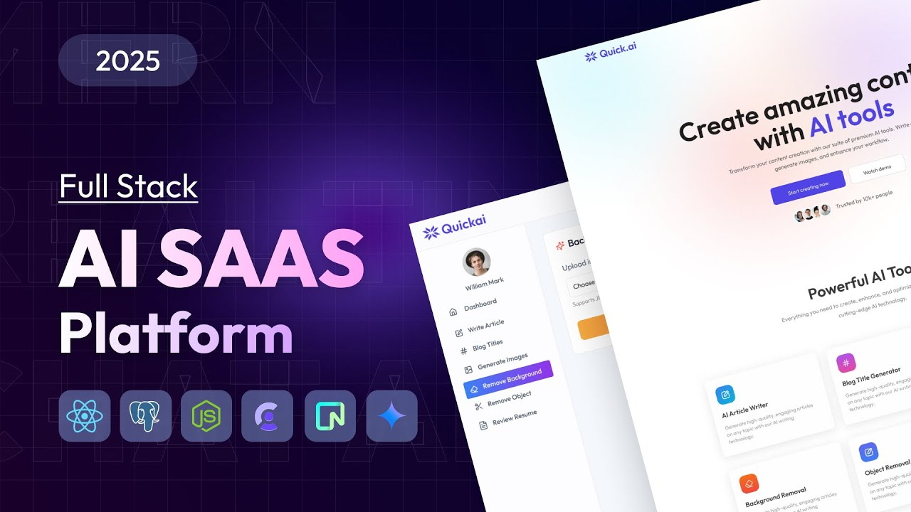

# ⚡ Quick AI

Quick AI is a full-stack AI SaaS platform that offers content generation, image editing, and resume analysis.
Built with React, Node.js, Clerk, Stripe, and Neon PostgreSQL, it delivers secure authentication, subscription billing,
and powerful AI features in a modern, responsive interface.

> 🚀 Live Demo: [quick-ai](https://quick-ai-beta-eight.vercel.app/ai)  
> 📂 Repository: [hilla10/quick_ai](https://github.com/hilla10/quick_ai)

---



---

## ✨ Key Features

- **🔐 User Authentication** – Secure sign-in, sign-up, and profile management powered by **Clerk**  
- **💳 Subscription Billing** – Premium subscription model to unlock advanced AI features  
- **🗄️ PostgreSQL Database** – Serverless database powered by **Neon** for reliability and scalability  

---

## 🧠 AI Features

- **📰 Article Generator** – Enter a title & desired length to generate AI-written articles  
- **✍️ Blog Title Generator** – Generate engaging blog titles using keywords and categories  
- **🖼️ Image Generator** – Provide a text prompt to generate AI-based images  
- **🪄 Background Remover** – Upload an image and get a transparent background version  
- **🎯 Object Remover** – Upload an image, describe the object, and remove it instantly with AI  
- **📄 Resume Analyzer** – Upload your resume and get a full AI-powered analysis & improvement tips  

---

## 🧰 Tech Stack

### Frontend
- React.js (Vite)
- Tailwind CSS
- React Router
- Axios

### Backend
- Node.js
- Express.js
- Clerk (Authentication)
- Neon (PostgreSQL serverless database)
- AI APIs (OpenAI)
- Stripe (for subscription billing)

---

## ⚙️ Installation & Setup

### 1. Clone the Repository
```bash
git clone https://github.com/hilla10/quick_ai.git
cd quick_ai

```
### 2. Install Dependencies
```bash
npm install
# or
yarn install

```
### 3. Configure Environment Variables
Create a .env file:
####. server/.env
```bash
DATABASE_URL=your_neon_postgres_url
CLERK_PUBLISHABLE_KEY=your_clerk_key
CLERK_SECRET_KEY=your_clerk_secret_key

GEMINI_API_KEY=your_gemini_api_key

CLIPDROP_API_KEY = your_clipdrop_api_key

CLOUDINARY_CLOUD_NAME =your_cloudinary_name
CLOUDINARY_API_KEY=your_cloudinary_api_key
CLOUDINARY_API_SECRET=your_cloudinary_secret
```
####. client/.env
```bash
VITE_CLERK_PUBLISHABLE_KEY=your_clerk_key
VITE_BASE_URL =your_backend_url
```
### 4. Run Development Server
```bash
npm run dev
# or
yarn dev
```
🧠 What I Learned

Building and deploying a full-stack AI SaaS platform

Integrating Clerk authentication and Stripe subscriptions

Using Neon PostgreSQL as a serverless database

Leveraging AI APIs for text and image manipulation

Creating real SaaS features like article generation, resume analysis, and image editing

📌 Disclaimer

This project is for educational and portfolio purposes.

Some AI features depend on third-party APIs and may have usage limits.

👨‍💻 Author

Hailemichael Negusse

GitHub: hilla10

Portfolio: https://portfolio-rho-gules-15.vercel.app/

📜 License

This project is open-source and available under the MIT License
.

  
